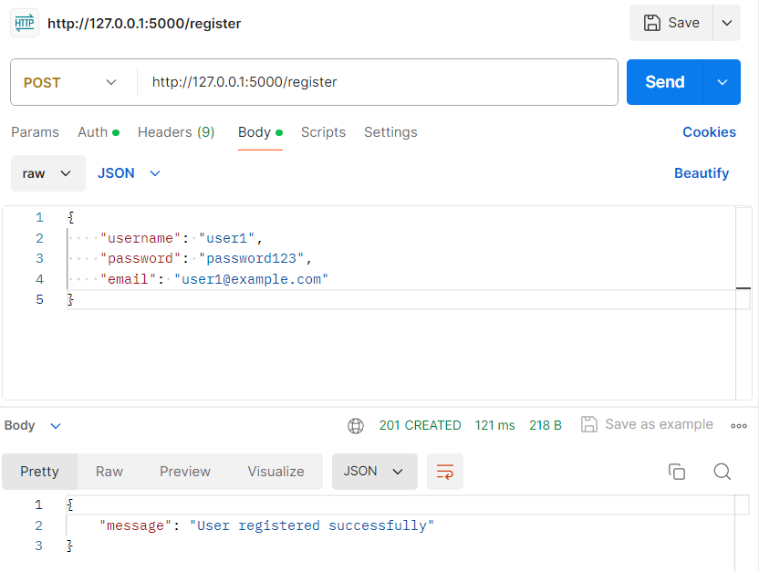
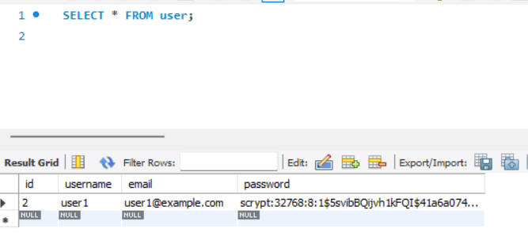
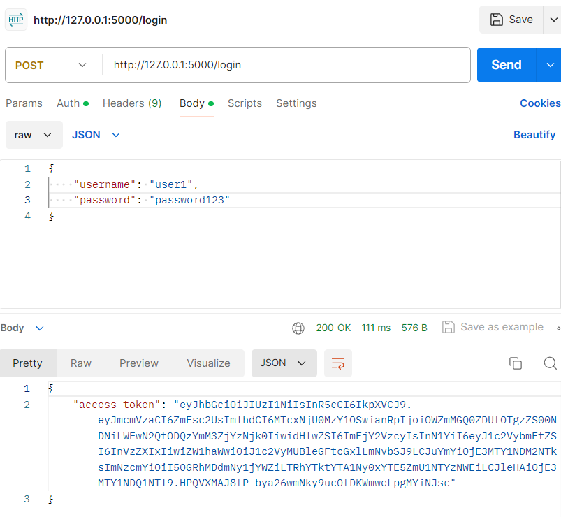
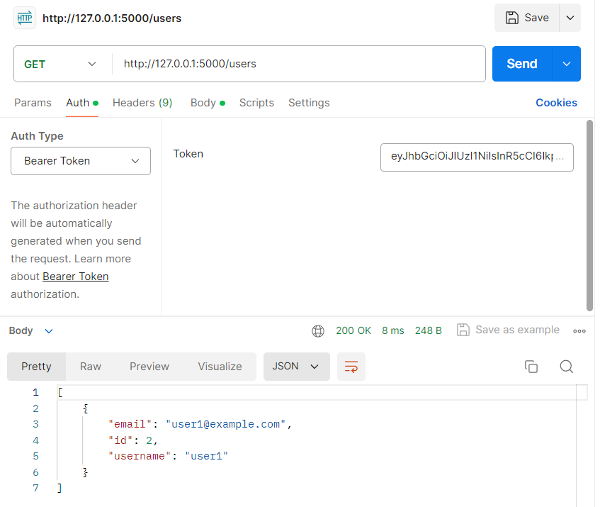
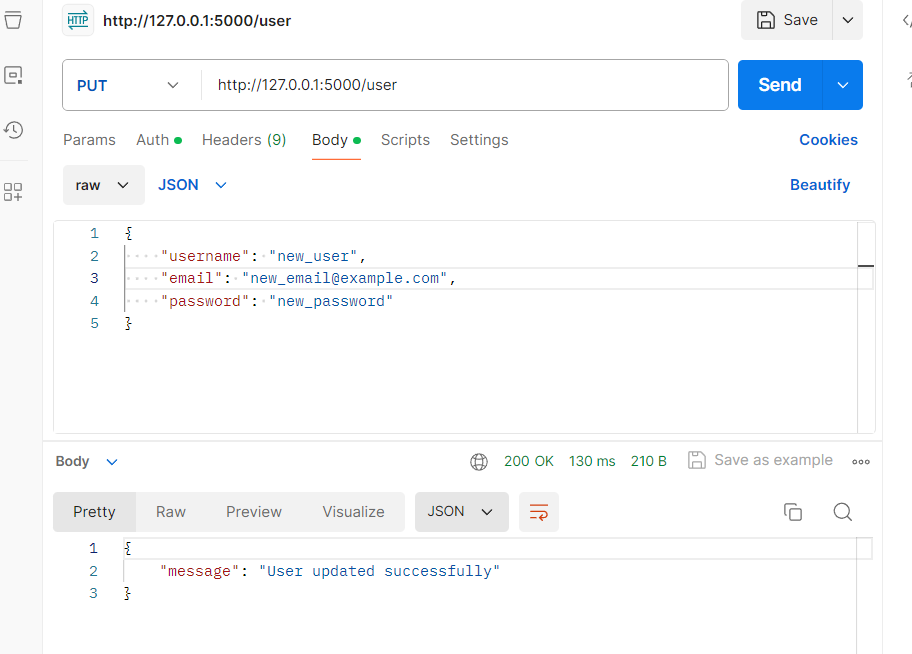
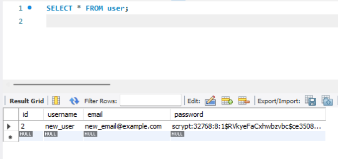
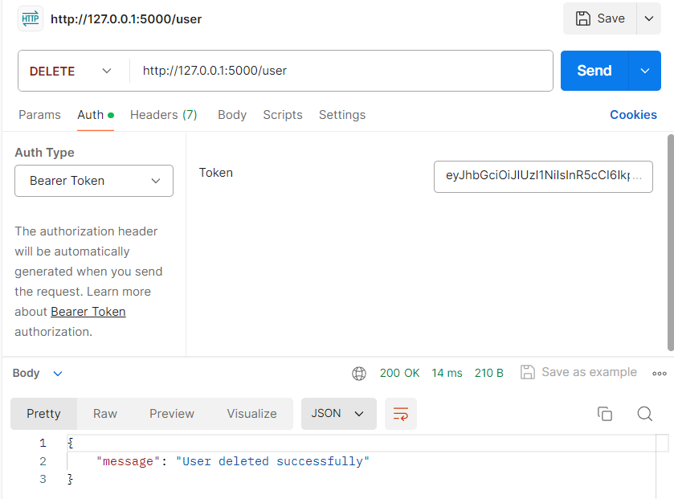
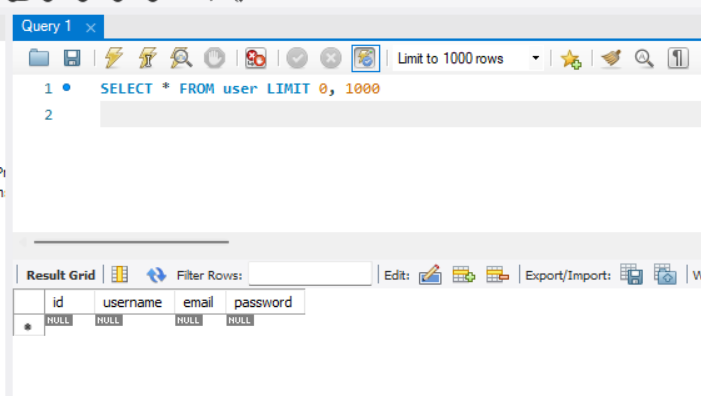
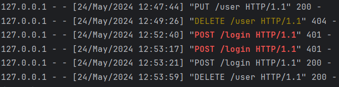

# Тестування працездатності системи

## Запуск сервера

  

## Тестування RESTfull API через запити HTTTP

## Реєстрація користувача

  

Зареєстровані користувачі:

  

## Авторизація користувача

  

## Отримання списку користувачів

  

## Оновлення інформації про користувача

  

Оновлена таблиця у Workbench:

  

## Видалення користувача

  

Підтвердження, що зареєстрованих користувачів немає:

  

## Вивід в консолі інформації про наші запити

  

